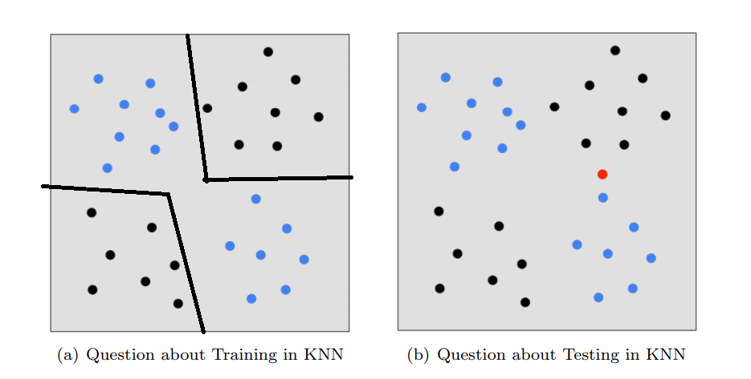

### question5

1. 

2.  
  According to position of red point, when k=1, there is only one blue point. Therefore, the label is blue.
  
  $k=1$ blue

According to posion of red point, when k=3 , there are two black points and one blue point.So the label is black.

  $k=3$ black

